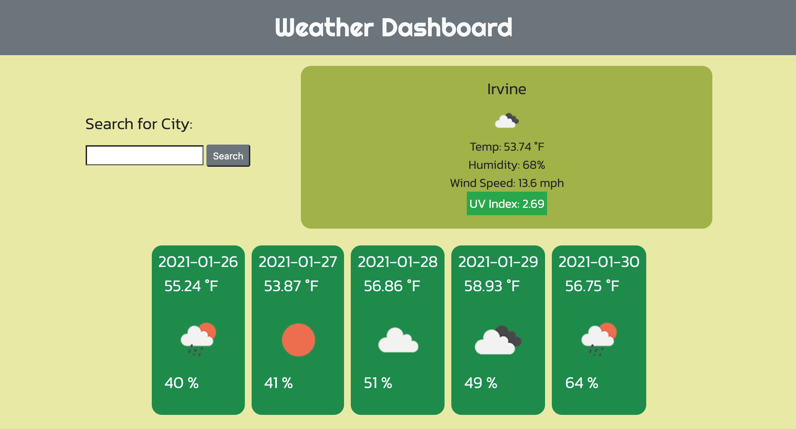
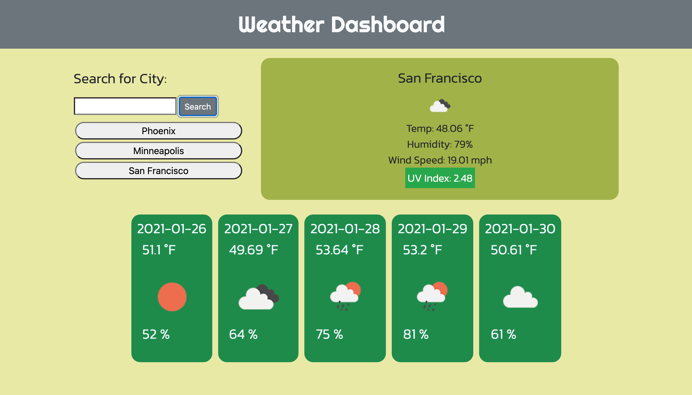

# Weather Dashboard

## Purpose
The Weather Dashboard displays the current weather conditions for a selected city. The city name, temp, humidity, windspeed, and UV index are all available to reference. In addition, the 5-day forecast for the selected city is presented in a series of five cards, along with an icon for easy condition reference. 

Once a city is searched, it is added to a list of buttons that appear below the search field. These buttons can be clicked to pull up that particular city's weather again without having to manually re-enter it within the search field. 

The UV Index field is also unique in that it is color-coordinated based on the danger of the particular index. A green box surrounds the value when it is under 3, a yellow box when it is between 3 and 6, and a red box when it edges over 6. 

## Built With:
 * JavaScript
 * jQuery
 * Bootstrap
 * Google Fonts
 * HTML
 * CSS

## Website 
https://gwarzecha.github.io/weather-dashboard/

## Creating the Application
Weather Dashboard was built without the aid of any starter code, each file built from the ground up. This was the most involved application I've built yet and consequently the one that I am most proud of at this stage in my progression as a developer. 

A big thanks goes out to Joey Jepson @alligatormonday and Andrew Moses @andrewmosesdrive for lending me their eyes when debugging, as well as helping me find a solution for the clickability of the dynamically created previously searched city buttons. David Wu @davidwu92 was also a huge help guiding me in the right direction with local storage. 

## Screenshots

